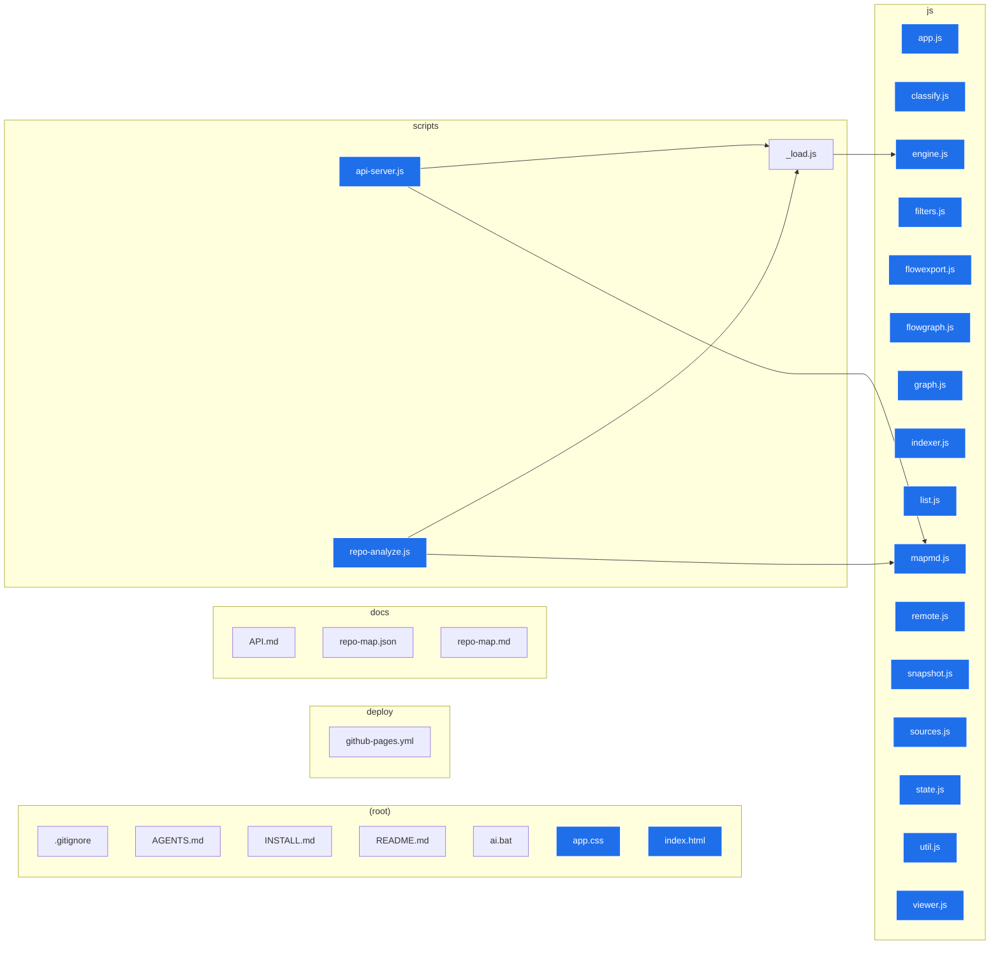

# Repository map — repository-visualizer

> Generated by the Repository Visualizer analysis engine.  
> **Generated:** 2026-06-26T22:05:55.192Z  
> **Root:** `repository-visualizer`

This is the **authoritative architecture map**: a directed import/dependency flow from start to end. It indexes **30** analyzable files (**21** code) joined by **5** import edges. **START** = 20 entry point(s); **END** = 0 terminal module(s); 0 import cycle(s) detected across 3 layered tier(s).

## Architecture flow diagram

## Entry points (START)

- `app.css` · seeded
- `index.html` · seeded
- `js/app.js` · seeded
- `js/classify.js` · seeded
- `js/engine.js` · seeded
- `js/filters.js` · seeded
- `js/flowexport.js` · seeded
- `js/flowgraph.js` · seeded
- `js/graph.js` · seeded
- `js/indexer.js` · seeded
- `js/list.js` · seeded
- `js/mapmd.js` · seeded
- `js/remote.js` · seeded
- `js/snapshot.js` · seeded
- `js/sources.js` · seeded
- `js/state.js` · seeded
- `js/util.js` · seeded
- `js/viewer.js` · seeded
- `scripts/api-server.js`
- `scripts/repo-analyze.js`

## Terminal modules (END)

_No terminal modules detected._

## Cycles

No cycles detected.

## Execution / dependency flow (START → END)

1. **Tier 0 · START** (27)
   - `.gitignore` _(normal)_
   - `AGENTS.md` _(normal)_
   - `INSTALL.md` _(normal)_
   - `README.md` _(normal)_
   - `ai.bat` _(normal)_
   - `app.css` _(entry)_
   - `deploy/github-pages.yml` _(normal)_
   - `docs/API.md` _(normal)_
   - `docs/repo-map.json` _(normal)_
   - `docs/repo-map.md` _(normal)_
   - `index.html` _(entry)_
   - `js/app.js` _(entry)_
   - `js/classify.js` _(entry)_
   - `js/filters.js` _(entry)_
   - `js/flowexport.js` _(entry)_
   - `js/flowgraph.js` _(entry)_
   - `js/graph.js` _(entry)_
   - `js/indexer.js` _(entry)_
   - `js/list.js` _(entry)_
   - `js/remote.js` _(entry)_
   - `js/snapshot.js` _(entry)_
   - `js/sources.js` _(entry)_
   - `js/state.js` _(entry)_
   - `js/util.js` _(entry)_
   - `js/viewer.js` _(entry)_
   - `scripts/api-server.js` _(entry)_
   - `scripts/repo-analyze.js` _(entry)_
2. **Tier 1** (2)
   - `js/mapmd.js` _(entry)_
   - `scripts/_load.js` _(normal)_
3. **Tier 2 · END** (1)
   - `js/engine.js` _(entry)_

## Module inventory

| Path | Type | In | Out | Role | Size |
|------|------|---:|----:|------|-----:|
| `.gitignore` | text | 0 | 0 | normal | 48 B |
| `AGENTS.md` | markdown | 0 | 0 | normal | 2.5 KB |
| `INSTALL.md` | markdown | 0 | 0 | normal | 2.7 KB |
| `README.md` | markdown | 0 | 0 | normal | 17 KB |
| `ai.bat` | code | 0 | 0 | normal | 28 KB |
| `app.css` | code | 0 | 0 | entry | 15 KB |
| `deploy/github-pages.yml` | text | 0 | 0 | normal | 1.6 KB |
| `docs/API.md` | markdown | 0 | 0 | normal | 11 KB |
| `docs/repo-map.json` | text | 0 | 0 | normal | 15 KB |
| `docs/repo-map.md` | markdown | 0 | 0 | normal | 6.6 KB |
| `index.html` | text | 0 | 0 | entry | 9.2 KB |
| `js/app.js` | code | 0 | 0 | entry | 24 KB |
| `js/classify.js` | code | 0 | 0 | entry | 7.3 KB |
| `js/engine.js` | code | 1 | 0 | entry | 21 KB |
| `js/filters.js` | code | 0 | 0 | entry | 2.6 KB |
| `js/flowexport.js` | code | 0 | 0 | entry | 2.3 KB |
| `js/flowgraph.js` | code | 0 | 0 | entry | 9.8 KB |
| `js/graph.js` | code | 0 | 0 | entry | 16 KB |
| `js/indexer.js` | code | 0 | 0 | entry | 3.9 KB |
| `js/list.js` | code | 0 | 0 | entry | 7.6 KB |
| `js/mapmd.js` | code | 2 | 0 | entry | 9.7 KB |
| `js/remote.js` | code | 0 | 0 | entry | 5.2 KB |
| `js/snapshot.js` | code | 0 | 0 | entry | 3.2 KB |
| `js/sources.js` | code | 0 | 0 | entry | 7.6 KB |
| `js/state.js` | code | 0 | 0 | entry | 3.5 KB |
| `js/util.js` | code | 0 | 0 | entry | 3.8 KB |
| `js/viewer.js` | code | 0 | 0 | entry | 10 KB |
| `scripts/_load.js` | code | 2 | 1 | normal | 10 KB |
| `scripts/api-server.js` | code | 0 | 2 | entry | 10 KB |
| `scripts/repo-analyze.js` | code | 0 | 2 | entry | 4.0 KB |

## Metrics

| Metric | Value |
|--------|------:|
| Files (analyzable) | 30 |
| Code files | 21 |
| Import edges | 5 |
| Entry points (START) | 20 |
| Terminal modules (END) | 0 |
| Cycles | 0 |
| Layered tiers (max depth) | 3 |
| Orphans (no edges) | 9 |
