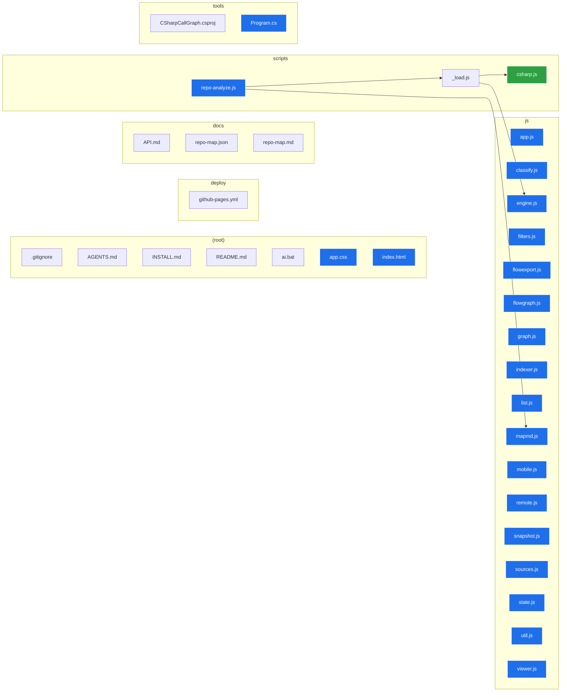

# Repository map — repository-visualizer

> Generated by the Repository Visualizer analysis engine.  
> **Generated:** 2026-06-27T03:57:10.975Z  
> **Root:** `repository-visualizer`

This is the **authoritative architecture map**: a directed import/dependency flow from start to end. It indexes **33** analyzable files (**23** code) joined by **4** import edges. **START** = 21 entry point(s); **END** = 1 terminal module(s); 0 import cycle(s) detected across 3 layered tier(s).

## Function call flow (code flow)

The actual **code flow** — functions as nodes, **arrows = calls** (who points to whom). Solid = sequential (**series**); dashed **parallel** = concurrent; dashed **recurses** = recursion; dashed **virtual** = a virtual/interface dispatch target; dashed **event** = an event handler. Analyzer: **mixed (roslyn + heuristic)** (compiler-accurate — follows overrides, interface implementations and events).  
**243** connected of **298** function(s) across **23** file(s), **382** call edge(s) (0 parallel), **15** recursive group(s), max fan-out **32**.

```mermaid
flowchart LR
  classDef entry fill:#1f6feb,stroke:#fff,color:#fff;
  classDef leaf fill:#2ea043,stroke:#fff,color:#fff;
  classDef cycle fill:#e0556b,stroke:#fff,color:#fff;
  classDef module fill:#8957e5,stroke:#fff,color:#fff;
  subgraph f___js_app_js["js/app.js"]
    repository_visualizer_js_app_js___module_["(module)"]:::module
    repository_visualizer_js_app_js__checkVendors_65["checkVendors"]:::leaf
    repository_visualizer_js_app_js__onSelect_88["onSelect"]
    repository_visualizer_js_app_js__selectEntry_92["selectEntry"]
    repository_visualizer_js_app_js__loadRawEntries_104["loadRawEntries"]
    repository_visualizer_js_app_js__recomputeFilters_140["recomputeFilters"]:::cycle
    repository_visualizer_js_app_js__readNamed_165["readNamed"]:::leaf
    repository_visualizer_js_app_js__getImportModel_173["getImportModel"]
    repository_visualizer_js_app_js__loadCallGraphSnapshot_194["loadCallGraphSnapshot"]:::leaf
    repository_visualizer_js_app_js__getCallModel_209["getCallModel"]
    repository_visualizer_js_app_js__renderFlow_224["renderFlow"]
    repository_visualizer_js_app_js__setFlowSub_258["setFlowSub"]
    repository_visualizer_js_app_js__setViewMode_270["setViewMode"]
    repository_visualizer_js_app_js__renderChips_295["renderChips"]:::cycle
    repository_visualizer_js_app_js__toggleExt_313["toggleExt"]:::cycle
    repository_visualizer_js_app_js__rootNameFromEntries_323["rootNameFromEntries"]:::leaf
    repository_visualizer_js_app_js__tryReopen_354["tryReopen"]
    repository_visualizer_js_app_js__loadFromUrl_365["loadFromUrl"]
    repository_visualizer_js_app_js__activeView_414["activeView"]:::leaf
    repository_visualizer_js_app_js__screenshotResolution_453["screenshotResolution"]:::leaf
    repository_visualizer_js_app_js__resolvedTheme_510["resolvedTheme"]:::leaf
    repository_visualizer_js_app_js__applyTheme_514["applyTheme"]
    repository_visualizer_js_app_js__initSplitter_545["initSplitter"]:::entry
    repository_visualizer_js_app_js__onMove_548["onMove"]:::leaf
    repository_visualizer_js_app_js__boot_577["boot"]
  end
  subgraph f___js_classify_js["js/classify.js"]
    repository_visualizer_js_classify_js__languageFor_106["languageFor"]:::leaf
    repository_visualizer_js_classify_js__classify_117["classify"]:::leaf
    repository_visualizer_js_classify_js__looksBinary_136["looksBinary"]:::leaf
    repository_visualizer_js_classify_js__extHue_160["extHue"]:::entry
    repository_visualizer_js_classify_js__noiseFlags_179["noiseFlags"]
  end
  subgraph f___js_engine_js["js/engine.js"]
    repository_visualizer_js_engine_js__baseName_22["baseName"]:::leaf
    repository_visualizer_js_engine_js__dirName_26["dirName"]:::leaf
    repository_visualizer_js_engine_js__extOf_31["extOf"]
    repository_visualizer_js_engine_js__normalizePath_37["normalizePath"]:::leaf
    repository_visualizer_js_engine_js__parseRefs_50["parseRefs"]:::leaf
    repository_visualizer_js_engine_js__resolveRef_72["resolveRef"]
    repository_visualizer_js_engine_js__isBinaryLike_132["isBinaryLike"]:::leaf
    repository_visualizer_js_engine_js__isNoiseSegment_134["isNoiseSegment"]:::leaf
    repository_visualizer_js_engine_js__isNoisePath_135["isNoisePath"]
    repository_visualizer_js_engine_js__typeOf_141["typeOf"]:::leaf
    repository_visualizer_js_engine_js__scriptSrcs_151["scriptSrcs"]:::leaf
    repository_visualizer_js_engine_js__isSeedName_160["isSeedName"]:::leaf
    repository_visualizer_js_engine_js__tarjanSCC_168["tarjanSCC"]:::leaf
    repository_visualizer_js_engine_js__buildModel_238["buildModel"]
    repository_visualizer_js_engine_js__seedSpec_325["seedSpec"]
    repository_visualizer_js_engine_js__findBackEdges_449["findBackEdges"]:::leaf
    repository_visualizer_js_engine_js__computeLayers_483["computeLayers"]:::leaf
    repository_visualizer_js_engine_js__maskCode_573["maskCode"]
    repository_visualizer_js_engine_js__blank_577["blank"]:::leaf
    repository_visualizer_js_engine_js__lineAt_596["lineAt"]:::leaf
    repository_visualizer_js_engine_js__matchPair_598["matchPair"]:::leaf
    repository_visualizer_js_engine_js__extractFunctionsJS_608["extractFunctionsJS"]
    repository_visualizer_js_engine_js__addBraced_611["addBraced"]
    repository_visualizer_js_engine_js__braceAfterParams_619["braceAfterParams"]
    repository_visualizer_js_engine_js__extractFunctionsPy_649["extractFunctionsPy"]:::leaf
    repository_visualizer_js_engine_js__extractCalls_672["extractCalls"]
    repository_visualizer_js_engine_js__parallelRanges_699["parallelRanges"]
    repository_visualizer_js_engine_js__buildCallGraph_716["buildCallGraph"]
    repository_visualizer_js_engine_js__ensureModule_775["ensureModule"]:::leaf
    repository_visualizer_js_engine_js__finalizeCallGraph_822["finalizeCallGraph"]
  end
  subgraph f___js_filters_js["js/filters.js"]
    repository_visualizer_js_filters_js__computeFiltered_12["computeFiltered"]
    repository_visualizer_js_filters_js__extFacets_54["extFacets"]
  end
  subgraph f___js_flowexport_js["js/flowexport.js"]
    repository_visualizer_js_flowexport_js__exportRepoMap_16["exportRepoMap"]
  end
  subgraph f___js_flowgraph_js["js/flowgraph.js"]
    repository_visualizer_js_flowgraph_js__createFlowView_13["createFlowView"]
    repository_visualizer_js_flowgraph_js__fit_23["fit"]:::leaf
    repository_visualizer_js_flowgraph_js__showMsg_44["showMsg"]:::leaf
    repository_visualizer_js_flowgraph_js__positionTip_51["positionTip"]:::leaf
    repository_visualizer_js_flowgraph_js__themeColors_56["themeColors"]:::leaf
    repository_visualizer_js_flowgraph_js__nodeColor_71["nodeColor"]:::leaf
    repository_visualizer_js_flowgraph_js__selectRenderNodes_81["selectRenderNodes"]:::leaf
    repository_visualizer_js_flowgraph_js__ensureNetwork_88["ensureNetwork"]
    repository_visualizer_js_flowgraph_js__build_122["build"]
    repository_visualizer_js_flowgraph_js__exportImage_203["exportImage"]:::entry
    repository_visualizer_js_flowgraph_js__finish_221["finish"]:::leaf
    repository_visualizer_js_flowgraph_js__capture_222["capture"]
    repository_visualizer_js_flowgraph_js__setModel_265["setModel"]:::entry
    repository_visualizer_js_flowgraph_js__refreshTheme_277["refreshTheme"]:::entry
    repository_visualizer_js_flowgraph_js__fit_283["fit"]:::entry
  end
  subgraph f___js_graph_js["js/graph.js"]
    repository_visualizer_js_graph_js__createGraphView_11["createGraphView"]
    repository_visualizer_js_graph_js__fit_29["fit"]:::leaf
    repository_visualizer_js_graph_js__positionTip_46["positionTip"]:::leaf
    repository_visualizer_js_graph_js__themeColors_51["themeColors"]:::leaf
    repository_visualizer_js_graph_js__dirSize_61["dirSize"]:::leaf
    repository_visualizer_js_graph_js__fileColor_64["fileColor"]
    repository_visualizer_js_graph_js__computeAutoExpansion_68["computeAutoExpansion"]:::leaf
    repository_visualizer_js_graph_js__seedPos_84["seedPos"]:::leaf
    repository_visualizer_js_graph_js__build_94["build"]
    repository_visualizer_js_graph_js__visit_107["visit"]:::cycle
    repository_visualizer_js_graph_js__rebuild_151["rebuild"]
    repository_visualizer_js_graph_js__freezePhysics_159["freezePhysics"]:::leaf
    repository_visualizer_js_graph_js__restabilize_167["restabilize"]:::leaf
    repository_visualizer_js_graph_js__ensureNetwork_178["ensureNetwork"]
    repository_visualizer_js_graph_js__toggleExpand_224["toggleExpand"]
    repository_visualizer_js_graph_js__setRefOverlay_235["setRefOverlay"]:::entry
    repository_visualizer_js_graph_js__expandAllFolders_275["expandAllFolders"]:::entry
    repository_visualizer_js_graph_js__addAll_277["addAll"]:::cycle
    repository_visualizer_js_graph_js__countNodes_282["countNodes"]:::cycle
    repository_visualizer_js_graph_js__exportImage_297["exportImage"]:::entry
    repository_visualizer_js_graph_js__finish_321["finish"]:::leaf
    repository_visualizer_js_graph_js__capture_325["capture"]
    repository_visualizer_js_graph_js__setTree_375["setTree"]:::entry
    repository_visualizer_js_graph_js__refreshTheme_392["refreshTheme"]:::entry
    repository_visualizer_js_graph_js__fit_400["fit"]:::entry
  end
  subgraph f___js_indexer_js["js/indexer.js"]
    repository_visualizer_js_indexer_js__makeEntry_15["makeEntry"]
    repository_visualizer_js_indexer_js__makeDir_34["makeDir"]:::leaf
    repository_visualizer_js_indexer_js__buildIndex_50["buildIndex"]
    repository_visualizer_js_indexer_js__finalizeCounts_88["finalizeCounts"]:::cycle
    repository_visualizer_js_indexer_js__sortTree_96["sortTree"]:::cycle
    repository_visualizer_js_indexer_js__pruneTree_107["pruneTree"]
    repository_visualizer_js_indexer_js__walk_108["walk"]:::cycle
  end
  subgraph f___js_list_js["js/list.js"]
    repository_visualizer_js_list_js__createListView_12["createListView"]
    repository_visualizer_js_list_js__isCollapsed_31["isCollapsed"]:::leaf
    repository_visualizer_js_list_js__flatten_36["flatten"]
    repository_visualizer_js_list_js__walk_39["walk"]:::cycle
    repository_visualizer_js_list_js__rowLabel_53["rowLabel"]
    repository_visualizer_js_list_js__renderWindow_70["renderWindow"]
    repository_visualizer_js_list_js__scheduleRender_98["scheduleRender"]:::entry
    repository_visualizer_js_list_js__activateRow_109["activateRow"]
    repository_visualizer_js_list_js__toggleDir_123["toggleDir"]
    repository_visualizer_js_list_js__moveFocus_149["moveFocus"]
    repository_visualizer_js_list_js__ensureVisible_156["ensureVisible"]:::leaf
    repository_visualizer_js_list_js__setTree_194["setTree"]:::entry
    repository_visualizer_js_list_js__setSelected_202["setSelected"]:::entry
    repository_visualizer_js_list_js__expandAll_211["expandAll"]
    repository_visualizer_js_list_js__collapseAll_216["collapseAll"]
    repository_visualizer_js_list_js__addDirs_217["addDirs"]:::cycle
  end
  subgraph f___js_mapmd_js["js/mapmd.js"]
    repository_visualizer_js_mapmd_js__relPath_24["relPath"]:::leaf
    repository_visualizer_js_mapmd_js__makeIdFactory_44["makeIdFactory"]:::leaf
    repository_visualizer_js_mapmd_js__idFor_47["idFor"]:::leaf
    repository_visualizer_js_mapmd_js__buildMarkdownMap_68["buildMarkdownMap"]
    repository_visualizer_js_mapmd_js__buildMermaid_179["buildMermaid"]
    repository_visualizer_js_mapmd_js__callNodeLabel_240["callNodeLabel"]
    repository_visualizer_js_mapmd_js__pushCallFlowSection_248["pushCallFlowSection"]
    repository_visualizer_js_mapmd_js__buildCallMermaid_278["buildCallMermaid"]
  end
  subgraph f___js_mobile_js["js/mobile.js"]
    repository_visualizer_js_mobile_js___module_["(module)"]:::module
    repository_visualizer_js_mobile_js__fireResize_24["fireResize"]:::leaf
    repository_visualizer_js_mobile_js__nudgeGraph_29["nudgeGraph"]
    repository_visualizer_js_mobile_js__setTab_38["setTab"]
    repository_visualizer_js_mobile_js__openTools_71["openTools"]:::leaf
    repository_visualizer_js_mobile_js__closeTools_76["closeTools"]:::leaf
    repository_visualizer_js_mobile_js__onMQ_107["onMQ"]:::entry
  end
  subgraph f___js_remote_js["js/remote.js"]
    repository_visualizer_js_remote_js__initToken_15["initToken"]:::leaf
    repository_visualizer_js_remote_js__setToken_24["setToken"]:::leaf
    repository_visualizer_js_remote_js__clearToken_31["clearToken"]:::leaf
    repository_visualizer_js_remote_js__parseRepoUrl_41["parseRepoUrl"]:::leaf
    repository_visualizer_js_remote_js__ghHeaders_66["ghHeaders"]:::leaf
    repository_visualizer_js_remote_js__ghApi_72["ghApi"]
    repository_visualizer_js_remote_js__fetchGitHubRepo_92["fetchGitHubRepo"]
    repository_visualizer_js_remote_js__loadGitRepo_121["loadGitRepo"]
  end
  subgraph f___js_snapshot_js["js/snapshot.js"]
    repository_visualizer_js_snapshot_js__buildSnapshot_13["buildSnapshot"]
    repository_visualizer_js_snapshot_js__exportSnapshot_51["exportSnapshot"]
  end
  subgraph f___js_sources_js["js/sources.js"]
    repository_visualizer_js_sources_js__rawEntriesFromFileList_13["rawEntriesFromFileList"]:::leaf
    repository_visualizer_js_sources_js__supportsFSAccess_24["supportsFSAccess"]:::leaf
    repository_visualizer_js_sources_js__pickDirectoryHandle_29["pickDirectoryHandle"]:::leaf
    repository_visualizer_js_sources_js__enumerateDirectoryHandle_42["enumerateDirectoryHandle"]
    repository_visualizer_js_sources_js__walk_47["walk"]:::cycle
    repository_visualizer_js_sources_js__openDB_79["openDB"]:::leaf
    repository_visualizer_js_sources_js__saveDirHandle_94["saveDirHandle"]
    repository_visualizer_js_sources_js__loadDirHandle_109["loadDirHandle"]
    repository_visualizer_js_sources_js__ensureReadPermission_126["ensureReadPermission"]:::leaf
    repository_visualizer_js_sources_js__loadSnapshot_141["loadSnapshot"]
    repository_visualizer_js_sources_js__normalizeSnapshot_153["normalizeSnapshot"]:::leaf
    repository_visualizer_js_sources_js__getFile_172["getFile"]:::cycle
    repository_visualizer_js_sources_js__hasContent_181["hasContent"]:::leaf
    repository_visualizer_js_sources_js__fetchRemote_186["fetchRemote"]:::leaf
    repository_visualizer_js_sources_js__readText_198["readText"]:::entry
    repository_visualizer_js_sources_js__readBytes_207["readBytes"]:::entry
    repository_visualizer_js_sources_js__objectUrlFor_218["objectUrlFor"]
  end
  subgraph f___js_state_js["js/state.js"]
    repository_visualizer_js_state_js___module_["(module)"]:::module
    repository_visualizer_js_state_js__defaultSettings_10["defaultSettings"]:::leaf
    repository_visualizer_js_state_js__loadSettings_23["loadSettings"]
    repository_visualizer_js_state_js__persistSettings_60["persistSettings"]:::leaf
    repository_visualizer_js_state_js__on_73["on"]:::leaf
    repository_visualizer_js_state_js__emit_79["emit"]:::leaf
    repository_visualizer_js_state_js__status_102["status"]
  end
  subgraph f___js_util_js["js/util.js"]
    repository_visualizer_js_util_js__debounce_8["debounce"]:::leaf
    repository_visualizer_js_util_js__clamp_33["clamp"]:::leaf
    repository_visualizer_js_util_js__formatBytes_38["formatBytes"]:::leaf
    repository_visualizer_js_util_js__basename_70["basename"]:::leaf
    repository_visualizer_js_util_js__dirname_75["dirname"]:::leaf
    repository_visualizer_js_util_js__el_87["el"]:::leaf
    repository_visualizer_js_util_js__hashStr_118["hashStr"]:::leaf
  end
  subgraph f___js_viewer_js["js/viewer.js"]
    repository_visualizer_js_viewer_js__createViewer_39["createViewer"]
    repository_visualizer_js_viewer_js__freePrevUrl_51["freePrevUrl"]:::leaf
    repository_visualizer_js_viewer_js__sizeCap_54["sizeCap"]:::leaf
    repository_visualizer_js_viewer_js__renderHeader_60["renderHeader"]
    repository_visualizer_js_viewer_js__chip_83["chip"]
    repository_visualizer_js_viewer_js__show_89["show"]:::cycle
    repository_visualizer_js_viewer_js__renderMarkdown_136["renderMarkdown"]
    repository_visualizer_js_viewer_js__renderCode_146["renderCode"]
    repository_visualizer_js_viewer_js__renderText_166["renderText"]
    repository_visualizer_js_viewer_js__renderImage_171["renderImage"]
    repository_visualizer_js_viewer_js__renderTooLarge_197["renderTooLarge"]:::cycle
    repository_visualizer_js_viewer_js__renderBinary_209["renderBinary"]:::cycle
    repository_visualizer_js_viewer_js__renderMessage_221["renderMessage"]
    repository_visualizer_js_viewer_js__metaTable_226["metaTable"]
    repository_visualizer_js_viewer_js__copyText_239["copyText"]
    repository_visualizer_js_viewer_js__ok_240["ok"]:::leaf
    repository_visualizer_js_viewer_js__fallbackCopy_245["fallbackCopy"]
    repository_visualizer_js_viewer_js__clear_259["clear"]:::entry
  end
  subgraph f___scripts__load_js["scripts/_load.js"]
    repository_visualizer_scripts__load_js__looksRemote_24["looksRemote"]:::leaf
    repository_visualizer_scripts__load_js__parseGitHub_30["parseGitHub"]:::leaf
    repository_visualizer_scripts__load_js__loadLocal_56["loadLocal"]
    repository_visualizer_scripts__load_js__walk_62["walk"]:::cycle
    repository_visualizer_scripts__load_js__cleanup_97["cleanup"]:::leaf
    repository_visualizer_scripts__load_js__execFileP_102["execFileP"]:::leaf
    repository_visualizer_scripts__load_js__loadGit_110["loadGit"]
    repository_visualizer_scripts__load_js__httpsRequest_133["httpsRequest"]
    repository_visualizer_scripts__load_js__ghHeaders_150["ghHeaders"]:::leaf
    repository_visualizer_scripts__load_js__ghApiJson_156["ghApiJson"]
    repository_visualizer_scripts__load_js__loadGitHubApi_165["loadGitHubApi"]
    repository_visualizer_scripts__load_js__readText_181["readText"]
    repository_visualizer_scripts__load_js__loadRepo_204["loadRepo"]
    repository_visualizer_scripts__load_js__analyze_220["analyze"]:::cycle
    repository_visualizer_scripts__load_js__cachedRead_227["cachedRead"]:::entry
    repository_visualizer_scripts__load_js__buildCallGraphWithProviders_256["buildCallGraphWithProviders"]:::cycle
  end
  subgraph f___scripts_providers_csharp_js["scripts/providers/csharp.js"]
    repository_visualizer_scripts_providers_csharp_js__execFileP_19["execFileP"]:::leaf
    repository_visualizer_scripts_providers_csharp_js__hasDotnet_28["hasDotnet"]
    repository_visualizer_scripts_providers_csharp_js__available_36["available"]
    repository_visualizer_scripts_providers_csharp_js__ensureBuilt_43["ensureBuilt"]
    repository_visualizer_scripts_providers_csharp_js__warmup_57["warmup"]:::entry
    repository_visualizer_scripts_providers_csharp_js__analyze_66["analyze"]:::entry
  end
  subgraph f___scripts_repo_analyze_js["scripts/repo-analyze.js"]
    repository_visualizer_scripts_repo_analyze_js___module_["(module)"]:::module
    repository_visualizer_scripts_repo_analyze_js__usage_24["usage"]:::leaf
    repository_visualizer_scripts_repo_analyze_js__resolveOut_30["resolveOut"]:::leaf
    repository_visualizer_scripts_repo_analyze_js__writeFileEnsured_41["writeFileEnsured"]
    repository_visualizer_scripts_repo_analyze_js__main_46["main"]
  end
  subgraph f___tools_CSharpCallGraph_Program_cs["tools/CSharpCallGraph/Program.cs"]
    repository_visualizer_tools_CSharpCallGraph_Program_cs__Program_Main_29_3["Program.Main"]:::entry
    repository_visualizer_tools_CSharpCallGraph_Program_cs__Prefixed_74_4["Prefixed"]:::leaf
    repository_visualizer_tools_CSharpCallGraph_Program_cs__DisplayName_80_4["DisplayName"]:::leaf
    repository_visualizer_tools_CSharpCallGraph_Program_cs__KindOf_96_4["KindOf"]:::leaf
    repository_visualizer_tools_CSharpCallGraph_Program_cs__DeclOf_106_4["DeclOf"]:::leaf
    repository_visualizer_tools_CSharpCallGraph_Program_cs__IdFor_107_4["IdFor"]
    repository_visualizer_tools_CSharpCallGraph_Program_cs__EnsureFunc_114_4["EnsureFunc"]
    repository_visualizer_tools_CSharpCallGraph_Program_cs__EnsureModule_121_4["EnsureModule"]:::leaf
    repository_visualizer_tools_CSharpCallGraph_Program_cs__AddEdge_127_4["AddEdge"]:::leaf
    repository_visualizer_tools_CSharpCallGraph_Program_cs__EnclosingId_133_4["EnclosingId"]
    repository_visualizer_tools_CSharpCallGraph_Program_cs__Program_CollectCs_234_3["Program.CollectCs"]:::cycle
    repository_visualizer_tools_CSharpCallGraph_Program_cs__Program_AllTypes_247_3["Program.AllTypes"]:::leaf
    repository_visualizer_tools_CSharpCallGraph_Program_cs__Program_IsDispatch_262_3["Program.IsDispatch"]:::leaf
    repository_visualizer_tools_CSharpCallGraph_Program_cs__Program_DispatchTargets_266_3["Program.DispatchTargets"]:::leaf
    repository_visualizer_tools_CSharpCallGraph_Program_cs__Program_EventOf_289_3["Program.EventOf"]:::leaf
    repository_visualizer_tools_CSharpCallGraph_Program_cs__Program_InParallel_299_3["Program.InParallel"]:::leaf
  end
  repository_visualizer_js_app_js___module_ --> repository_visualizer_js_viewer_js__createViewer_39
  repository_visualizer_js_app_js___module_ --> repository_visualizer_js_list_js__createListView_12
  repository_visualizer_js_app_js___module_ --> repository_visualizer_js_app_js__selectEntry_92
  repository_visualizer_js_app_js___module_ --> repository_visualizer_js_graph_js__createGraphView_11
  repository_visualizer_js_app_js___module_ --> repository_visualizer_js_flowgraph_js__createFlowView_13
  repository_visualizer_js_app_js__onSelect_88 --> repository_visualizer_js_app_js__selectEntry_92
  repository_visualizer_js_app_js__selectEntry_92 --> repository_visualizer_js_state_js__emit_79
  repository_visualizer_js_app_js__selectEntry_92 --> repository_visualizer_js_viewer_js__show_89
  repository_visualizer_js_app_js__loadRawEntries_104 --> repository_visualizer_js_state_js__status_102
  repository_visualizer_js_app_js__loadRawEntries_104 --> repository_visualizer_js_indexer_js__buildIndex_50
  repository_visualizer_js_app_js__loadRawEntries_104 --> repository_visualizer_js_state_js__emit_79
  repository_visualizer_js_app_js__loadRawEntries_104 --> repository_visualizer_js_app_js__recomputeFilters_140
  repository_visualizer_js_app_js___module_ --> repository_visualizer_js_util_js__debounce_8
  repository_visualizer_js_app_js___module_ --> repository_visualizer_js_state_js__status_102
  repository_visualizer_js_app_js__recomputeFilters_140 --> repository_visualizer_js_filters_js__computeFiltered_12
  repository_visualizer_js_app_js__recomputeFilters_140 -. "recurses" .-> repository_visualizer_js_app_js__renderChips_295
  repository_visualizer_js_app_js__getImportModel_173 --> repository_visualizer_js_app_js__readNamed_165
  repository_visualizer_js_app_js__getImportModel_173 --> repository_visualizer_js_engine_js__buildModel_238
  repository_visualizer_js_app_js__getCallModel_209 --> repository_visualizer_js_app_js__loadCallGraphSnapshot_194
  repository_visualizer_js_app_js__getCallModel_209 --> repository_visualizer_js_engine_js__buildCallGraph_716
  repository_visualizer_js_app_js__renderFlow_224 --> repository_visualizer_js_state_js__status_102
  repository_visualizer_js_app_js__renderFlow_224 --> repository_visualizer_js_app_js__getCallModel_209
  repository_visualizer_js_app_js__renderFlow_224 --> repository_visualizer_js_app_js__getImportModel_173
  repository_visualizer_js_app_js__setFlowSub_258 --> repository_visualizer_js_app_js__renderFlow_224
  repository_visualizer_js_app_js___module_ --> repository_visualizer_js_app_js__setFlowSub_258
  repository_visualizer_js_app_js__setViewMode_270 --> repository_visualizer_js_app_js__renderFlow_224
  repository_visualizer_js_app_js___module_ --> repository_visualizer_js_app_js__setViewMode_270
  repository_visualizer_js_app_js___module_ --> repository_visualizer_js_state_js__on_73
  repository_visualizer_js_app_js___module_ --> repository_visualizer_js_app_js__renderFlow_224
  repository_visualizer_js_app_js__renderChips_295 --> repository_visualizer_js_filters_js__extFacets_54
  repository_visualizer_js_app_js__renderChips_295 -. "recurses" .-> repository_visualizer_js_app_js__toggleExt_313
  repository_visualizer_js_app_js__toggleExt_313 -. "recurses" .-> repository_visualizer_js_app_js__recomputeFilters_140
  repository_visualizer_js_app_js___module_ --> repository_visualizer_js_sources_js__rawEntriesFromFileList_13
  repository_visualizer_js_app_js___module_ --> repository_visualizer_js_app_js__loadRawEntries_104
  repository_visualizer_js_app_js___module_ --> repository_visualizer_js_app_js__rootNameFromEntries_323
  repository_visualizer_js_app_js___module_ --> repository_visualizer_js_sources_js__supportsFSAccess_24
  repository_visualizer_js_app_js___module_ --> repository_visualizer_js_sources_js__pickDirectoryHandle_29
  repository_visualizer_js_app_js___module_ --> repository_visualizer_js_sources_js__enumerateDirectoryHandle_42
  repository_visualizer_js_app_js___module_ --> repository_visualizer_js_sources_js__saveDirHandle_94
  repository_visualizer_js_app_js__tryReopen_354 --> repository_visualizer_js_sources_js__ensureReadPermission_126
  repository_visualizer_js_app_js__tryReopen_354 --> repository_visualizer_js_state_js__status_102
  repository_visualizer_js_app_js__tryReopen_354 --> repository_visualizer_js_sources_js__enumerateDirectoryHandle_42
  repository_visualizer_js_app_js__tryReopen_354 --> repository_visualizer_js_app_js__loadRawEntries_104
  repository_visualizer_js_app_js__tryReopen_354 --> repository_visualizer_js_sources_js__saveDirHandle_94
  repository_visualizer_js_app_js__loadFromUrl_365 --> repository_visualizer_js_state_js__status_102
  repository_visualizer_js_app_js__loadFromUrl_365 --> repository_visualizer_js_remote_js__setToken_24
  repository_visualizer_js_app_js__loadFromUrl_365 --> repository_visualizer_js_remote_js__loadGitRepo_121
  repository_visualizer_js_app_js__loadFromUrl_365 --> repository_visualizer_js_app_js__loadRawEntries_104
  repository_visualizer_js_app_js___module_ --> repository_visualizer_js_app_js__loadFromUrl_365
  repository_visualizer_js_app_js___module_ --> repository_visualizer_js_remote_js__clearToken_31
  repository_visualizer_js_app_js___module_ --> repository_visualizer_js_app_js__recomputeFilters_140
  repository_visualizer_js_app_js___module_ --> repository_visualizer_js_state_js__persistSettings_60
  repository_visualizer_js_app_js___module_ --> repository_visualizer_js_list_js__expandAll_211
  repository_visualizer_js_app_js___module_ --> repository_visualizer_js_list_js__collapseAll_216
  repository_visualizer_js_app_js___module_ --> repository_visualizer_js_app_js__activeView_414
  repository_visualizer_js_app_js___module_ --> repository_visualizer_js_app_js__screenshotResolution_453
  repository_visualizer_js_app_js___module_ --> repository_visualizer_js_snapshot_js__exportSnapshot_51
  repository_visualizer_js_app_js___module_ --> repository_visualizer_js_app_js__getImportModel_173
  repository_visualizer_js_app_js___module_ --> repository_visualizer_js_app_js__getCallModel_209
  repository_visualizer_js_app_js___module_ --> repository_visualizer_js_flowexport_js__exportRepoMap_16
  repository_visualizer_js_app_js__applyTheme_514 --> repository_visualizer_js_app_js__resolvedTheme_510
  repository_visualizer_js_app_js___module_ --> repository_visualizer_js_app_js__applyTheme_514
  repository_visualizer_js_app_js__initSplitter_545 --> repository_visualizer_js_app_js__onMove_548
  repository_visualizer_js_app_js__boot_577 --> repository_visualizer_js_app_js__checkVendors_65
  repository_visualizer_js_app_js__boot_577 --> repository_visualizer_js_app_js__applyTheme_514
  repository_visualizer_js_app_js__boot_577 --> repository_visualizer_js_state_js__persistSettings_60
  repository_visualizer_js_app_js__boot_577 --> repository_visualizer_js_remote_js__initToken_15
  repository_visualizer_js_app_js__boot_577 --> repository_visualizer_js_sources_js__supportsFSAccess_24
  repository_visualizer_js_app_js__boot_577 --> repository_visualizer_js_sources_js__loadDirHandle_109
  repository_visualizer_js_app_js__boot_577 --> repository_visualizer_js_app_js__tryReopen_354
  repository_visualizer_js_app_js__boot_577 --> repository_visualizer_js_sources_js__ensureReadPermission_126
  repository_visualizer_js_app_js__boot_577 --> repository_visualizer_js_sources_js__loadSnapshot_141
  repository_visualizer_js_app_js__boot_577 --> repository_visualizer_js_app_js__loadRawEntries_104
  repository_visualizer_js_app_js__boot_577 --> repository_visualizer_js_state_js__status_102
  repository_visualizer_js_app_js___module_ --> repository_visualizer_js_app_js__boot_577
  repository_visualizer_js_classify_js__extHue_160 --> repository_visualizer_js_util_js__hashStr_118
  repository_visualizer_js_classify_js__noiseFlags_179 --> repository_visualizer_js_util_js__basename_70
  repository_visualizer_js_engine_js__extOf_31 --> repository_visualizer_js_engine_js__baseName_22
  repository_visualizer_js_engine_js__resolveRef_72 --> repository_visualizer_js_engine_js__normalizePath_37
  repository_visualizer_js_engine_js__resolveRef_72 --> repository_visualizer_js_engine_js__baseName_22
  repository_visualizer_js_engine_js__isNoisePath_135 --> repository_visualizer_js_engine_js__isNoiseSegment_134
  repository_visualizer_js_engine_js__buildModel_238 --> repository_visualizer_js_engine_js__isNoisePath_135
  repository_visualizer_js_engine_js__buildModel_238 --> repository_visualizer_js_engine_js__baseName_22
  repository_visualizer_js_engine_js__buildModel_238 --> repository_visualizer_js_engine_js__extOf_31
  repository_visualizer_js_engine_js__buildModel_238 --> repository_visualizer_js_engine_js__isBinaryLike_132
  repository_visualizer_js_engine_js__buildModel_238 --> repository_visualizer_js_engine_js__typeOf_141
  repository_visualizer_js_engine_js__buildModel_238 --> repository_visualizer_js_engine_js__parseRefs_50
  repository_visualizer_js_engine_js__buildModel_238 --> repository_visualizer_js_engine_js__resolveRef_72
  repository_visualizer_js_engine_js__buildModel_238 --> repository_visualizer_js_engine_js__dirName_26
  repository_visualizer_js_engine_js__buildModel_238 --> repository_visualizer_js_engine_js__scriptSrcs_151
  repository_visualizer_js_engine_js__buildModel_238 --> repository_visualizer_js_engine_js__normalizePath_37
  repository_visualizer_js_engine_js__seedSpec_325 --> repository_visualizer_js_engine_js__normalizePath_37
  repository_visualizer_js_engine_js__buildModel_238 --> repository_visualizer_js_engine_js__seedSpec_325
  repository_visualizer_js_engine_js__buildModel_238 --> repository_visualizer_js_engine_js__isSeedName_160
  repository_visualizer_js_engine_js__buildModel_238 --> repository_visualizer_js_engine_js__tarjanSCC_168
  repository_visualizer_js_engine_js__buildModel_238 --> repository_visualizer_js_engine_js__findBackEdges_449
  repository_visualizer_js_engine_js__buildModel_238 --> repository_visualizer_js_engine_js__computeLayers_483
  repository_visualizer_js_engine_js__maskCode_573 --> repository_visualizer_js_engine_js__blank_577
  repository_visualizer_js_engine_js__addBraced_611 --> repository_visualizer_js_engine_js__matchPair_598
  repository_visualizer_js_engine_js__braceAfterParams_619 --> repository_visualizer_js_engine_js__matchPair_598
  repository_visualizer_js_engine_js__extractFunctionsJS_608 --> repository_visualizer_js_engine_js__addBraced_611
  repository_visualizer_js_engine_js__extractFunctionsJS_608 --> repository_visualizer_js_engine_js__braceAfterParams_619
  repository_visualizer_js_engine_js__extractCalls_672 --> repository_visualizer_js_engine_js__matchPair_598
  repository_visualizer_js_engine_js__parallelRanges_699 --> repository_visualizer_js_engine_js__matchPair_598
  repository_visualizer_js_engine_js__buildCallGraph_716 --> repository_visualizer_js_engine_js__isNoisePath_135
  repository_visualizer_js_engine_js__buildCallGraph_716 --> repository_visualizer_js_engine_js__extOf_31
  repository_visualizer_js_engine_js__buildCallGraph_716 --> repository_visualizer_js_engine_js__typeOf_141
  repository_visualizer_js_engine_js__buildCallGraph_716 --> repository_visualizer_js_engine_js__baseName_22
  repository_visualizer_js_engine_js__buildCallGraph_716 --> repository_visualizer_js_engine_js__maskCode_573
  repository_visualizer_js_engine_js__buildCallGraph_716 --> repository_visualizer_js_engine_js__extractFunctionsPy_649
  repository_visualizer_js_engine_js__buildCallGraph_716 --> repository_visualizer_js_engine_js__extractFunctionsJS_608
  repository_visualizer_js_engine_js__buildCallGraph_716 --> repository_visualizer_js_engine_js__lineAt_596
  repository_visualizer_js_engine_js__buildCallGraph_716 --> repository_visualizer_js_engine_js__extractCalls_672
  repository_visualizer_js_engine_js__buildCallGraph_716 --> repository_visualizer_js_engine_js__parallelRanges_699
  repository_visualizer_js_engine_js__buildCallGraph_716 --> repository_visualizer_js_engine_js__ensureModule_775
  repository_visualizer_js_engine_js__buildCallGraph_716 --> repository_visualizer_js_engine_js__finalizeCallGraph_822
  repository_visualizer_js_engine_js__finalizeCallGraph_822 --> repository_visualizer_js_engine_js__tarjanSCC_168
  repository_visualizer_js_filters_js__computeFiltered_12 --> repository_visualizer_js_classify_js__noiseFlags_179
  repository_visualizer_js_filters_js__computeFiltered_12 --> repository_visualizer_js_indexer_js__pruneTree_107
  repository_visualizer_js_filters_js__extFacets_54 --> repository_visualizer_js_classify_js__noiseFlags_179
  repository_visualizer_js_flowexport_js__exportRepoMap_16 --> repository_visualizer_js_mapmd_js__buildMarkdownMap_68
  repository_visualizer_js_flowgraph_js__createFlowView_13 --> repository_visualizer_js_util_js__el_87
  repository_visualizer_js_flowgraph_js__createFlowView_13 --> repository_visualizer_js_flowgraph_js__positionTip_51
  repository_visualizer_js_flowgraph_js__ensureNetwork_88 --> repository_visualizer_js_flowgraph_js__themeColors_56
  repository_visualizer_js_flowgraph_js__ensureNetwork_88 --> repository_visualizer_js_state_js__on_73
  repository_visualizer_js_flowgraph_js__ensureNetwork_88 --> repository_visualizer_js_app_js__onSelect_88
  repository_visualizer_js_flowgraph_js__ensureNetwork_88 --> repository_visualizer_js_flowgraph_js__positionTip_51
  repository_visualizer_js_flowgraph_js__ensureNetwork_88 --> repository_visualizer_js_flowgraph_js__fit_23
  repository_visualizer_js_flowgraph_js__build_122 --> repository_visualizer_js_flowgraph_js__ensureNetwork_88
  repository_visualizer_js_flowgraph_js__build_122 --> repository_visualizer_js_flowgraph_js__themeColors_56
  repository_visualizer_js_flowgraph_js__build_122 --> repository_visualizer_js_flowgraph_js__showMsg_44
  repository_visualizer_js_flowgraph_js__build_122 --> repository_visualizer_js_flowgraph_js__selectRenderNodes_81
  repository_visualizer_js_flowgraph_js__build_122 --> repository_visualizer_js_flowgraph_js__nodeColor_71
  repository_visualizer_js_flowgraph_js__exportImage_203 --> repository_visualizer_js_flowgraph_js__themeColors_56
  repository_visualizer_js_flowgraph_js__capture_222 --> repository_visualizer_js_flowgraph_js__finish_221
  repository_visualizer_js_flowgraph_js__exportImage_203 --> repository_visualizer_js_flowgraph_js__finish_221
  repository_visualizer_js_flowgraph_js__exportImage_203 --> repository_visualizer_js_state_js__on_73
  repository_visualizer_js_flowgraph_js__exportImage_203 --> repository_visualizer_js_flowgraph_js__fit_23
  repository_visualizer_js_flowgraph_js__exportImage_203 --> repository_visualizer_js_flowgraph_js__capture_222
  repository_visualizer_js_flowgraph_js__setModel_265 --> repository_visualizer_js_flowgraph_js__build_122
  repository_visualizer_js_flowgraph_js__refreshTheme_277 --> repository_visualizer_js_flowgraph_js__build_122
  repository_visualizer_js_flowgraph_js__refreshTheme_277 --> repository_visualizer_js_flowgraph_js__themeColors_56
  repository_visualizer_js_flowgraph_js__fit_283 --> repository_visualizer_js_flowgraph_js__fit_23
  repository_visualizer_js_graph_js__createGraphView_11 --> repository_visualizer_js_util_js__el_87
  repository_visualizer_js_graph_js__createGraphView_11 --> repository_visualizer_js_graph_js__positionTip_46
  repository_visualizer_js_graph_js__fileColor_64 --> repository_visualizer_js_classify_js__classify_117
  repository_visualizer_js_graph_js__build_94 --> repository_visualizer_js_graph_js__themeColors_51
  repository_visualizer_js_graph_js__build_94 --> repository_visualizer_js_graph_js__seedPos_84
  repository_visualizer_js_graph_js__visit_107 --> repository_visualizer_js_graph_js__seedPos_84
  repository_visualizer_js_graph_js__visit_107 --> repository_visualizer_js_graph_js__dirSize_61
  repository_visualizer_js_graph_js__visit_107 -. "recurses" .-> repository_visualizer_js_graph_js__visit_107
  repository_visualizer_js_graph_js__visit_107 --> repository_visualizer_js_graph_js__fileColor_64
  repository_visualizer_js_graph_js__build_94 --> repository_visualizer_js_graph_js__visit_107
  repository_visualizer_js_graph_js__rebuild_151 --> repository_visualizer_js_graph_js__build_94
  repository_visualizer_js_graph_js__ensureNetwork_178 --> repository_visualizer_js_graph_js__themeColors_51
  repository_visualizer_js_graph_js__ensureNetwork_178 --> repository_visualizer_js_state_js__on_73
  repository_visualizer_js_graph_js__ensureNetwork_178 --> repository_visualizer_js_graph_js__toggleExpand_224
  repository_visualizer_js_graph_js__ensureNetwork_178 --> repository_visualizer_js_app_js__onSelect_88
  repository_visualizer_js_graph_js__ensureNetwork_178 --> repository_visualizer_js_graph_js__positionTip_46
  repository_visualizer_js_graph_js__ensureNetwork_178 --> repository_visualizer_js_graph_js__fit_29
  repository_visualizer_js_graph_js__ensureNetwork_178 --> repository_visualizer_js_graph_js__freezePhysics_159
  repository_visualizer_js_graph_js__toggleExpand_224 --> repository_visualizer_js_graph_js__rebuild_151
  repository_visualizer_js_graph_js__toggleExpand_224 --> repository_visualizer_js_graph_js__restabilize_167
  repository_visualizer_js_graph_js__setRefOverlay_235 --> repository_visualizer_js_graph_js__themeColors_51
  repository_visualizer_js_graph_js__setRefOverlay_235 --> repository_visualizer_js_classify_js__classify_117
  repository_visualizer_js_graph_js__setRefOverlay_235 --> repository_visualizer_js_engine_js__parseRefs_50
  repository_visualizer_js_graph_js__setRefOverlay_235 --> repository_visualizer_js_engine_js__resolveRef_72
  repository_visualizer_js_graph_js__addAll_277 -. "recurses" .-> repository_visualizer_js_graph_js__addAll_277
  repository_visualizer_js_graph_js__expandAllFolders_275 --> repository_visualizer_js_graph_js__addAll_277
  repository_visualizer_js_graph_js__countNodes_282 -. "recurses" .-> repository_visualizer_js_graph_js__countNodes_282
  repository_visualizer_js_graph_js__expandAllFolders_275 --> repository_visualizer_js_graph_js__countNodes_282
  repository_visualizer_js_graph_js__expandAllFolders_275 --> repository_visualizer_js_graph_js__rebuild_151
  repository_visualizer_js_graph_js__expandAllFolders_275 --> repository_visualizer_js_graph_js__restabilize_167
  repository_visualizer_js_graph_js__exportImage_297 --> repository_visualizer_js_graph_js__themeColors_51
  repository_visualizer_js_graph_js__capture_325 --> repository_visualizer_js_graph_js__finish_321
  repository_visualizer_js_graph_js__exportImage_297 --> repository_visualizer_js_graph_js__finish_321
  repository_visualizer_js_graph_js__exportImage_297 --> repository_visualizer_js_state_js__on_73
  repository_visualizer_js_graph_js__exportImage_297 --> repository_visualizer_js_graph_js__fit_29
  repository_visualizer_js_graph_js__exportImage_297 --> repository_visualizer_js_graph_js__capture_325
  repository_visualizer_js_graph_js__setTree_375 --> repository_visualizer_js_graph_js__ensureNetwork_178
  repository_visualizer_js_graph_js__setTree_375 --> repository_visualizer_js_graph_js__computeAutoExpansion_68
  repository_visualizer_js_graph_js__setTree_375 --> repository_visualizer_js_graph_js__rebuild_151
  repository_visualizer_js_graph_js__setTree_375 --> repository_visualizer_js_graph_js__restabilize_167
  repository_visualizer_js_graph_js__refreshTheme_392 --> repository_visualizer_js_graph_js__rebuild_151
  repository_visualizer_js_graph_js__refreshTheme_392 --> repository_visualizer_js_graph_js__themeColors_51
  repository_visualizer_js_graph_js__fit_400 --> repository_visualizer_js_graph_js__fit_29
  repository_visualizer_js_indexer_js__makeEntry_15 --> repository_visualizer_js_util_js__basename_70
  repository_visualizer_js_indexer_js__makeEntry_15 --> repository_visualizer_js_util_js__dirname_75
  repository_visualizer_js_indexer_js__buildIndex_50 --> repository_visualizer_js_indexer_js__makeDir_34
  repository_visualizer_js_indexer_js__buildIndex_50 --> repository_visualizer_js_indexer_js__makeEntry_15
  repository_visualizer_js_indexer_js__buildIndex_50 --> repository_visualizer_js_indexer_js__finalizeCounts_88
  repository_visualizer_js_indexer_js__buildIndex_50 --> repository_visualizer_js_indexer_js__sortTree_96
  repository_visualizer_js_indexer_js__finalizeCounts_88 -. "recurses" .-> repository_visualizer_js_indexer_js__finalizeCounts_88
  repository_visualizer_js_indexer_js__sortTree_96 -. "recurses" .-> repository_visualizer_js_indexer_js__sortTree_96
  repository_visualizer_js_indexer_js__walk_108 -. "recurses" .-> repository_visualizer_js_indexer_js__walk_108
  repository_visualizer_js_indexer_js__pruneTree_107 --> repository_visualizer_js_indexer_js__walk_108
  repository_visualizer_js_list_js__createListView_12 --> repository_visualizer_js_util_js__el_87
  repository_visualizer_js_list_js__walk_39 --> repository_visualizer_js_list_js__isCollapsed_31
  repository_visualizer_js_list_js__walk_39 -. "recurses" .-> repository_visualizer_js_list_js__walk_39
  repository_visualizer_js_list_js__flatten_36 --> repository_visualizer_js_list_js__walk_39
  repository_visualizer_js_list_js__rowLabel_53 --> repository_visualizer_js_list_js__isCollapsed_31
  repository_visualizer_js_list_js__rowLabel_53 --> repository_visualizer_js_util_js__el_87
  repository_visualizer_js_list_js__rowLabel_53 --> repository_visualizer_js_classify_js__classify_117
  repository_visualizer_js_list_js__rowLabel_53 --> repository_visualizer_js_util_js__formatBytes_38
  repository_visualizer_js_list_js__renderWindow_70 --> repository_visualizer_js_util_js__clamp_33
  repository_visualizer_js_list_js__renderWindow_70 --> repository_visualizer_js_util_js__el_87
  repository_visualizer_js_list_js__renderWindow_70 --> repository_visualizer_js_list_js__rowLabel_53
  repository_visualizer_js_list_js__renderWindow_70 --> repository_visualizer_js_list_js__isCollapsed_31
  repository_visualizer_js_list_js__scheduleRender_98 --> repository_visualizer_js_list_js__renderWindow_70
  repository_visualizer_js_list_js__activateRow_109 --> repository_visualizer_js_list_js__toggleDir_123
  repository_visualizer_js_list_js__activateRow_109 --> repository_visualizer_js_app_js__onSelect_88
  repository_visualizer_js_list_js__activateRow_109 --> repository_visualizer_js_list_js__renderWindow_70
  repository_visualizer_js_list_js__toggleDir_123 --> repository_visualizer_js_list_js__flatten_36
  repository_visualizer_js_list_js__toggleDir_123 --> repository_visualizer_js_list_js__renderWindow_70
  repository_visualizer_js_list_js__createListView_12 --> repository_visualizer_js_list_js__toggleDir_123
  repository_visualizer_js_list_js__createListView_12 --> repository_visualizer_js_app_js__onSelect_88
  repository_visualizer_js_list_js__createListView_12 --> repository_visualizer_js_list_js__renderWindow_70
  repository_visualizer_js_list_js__moveFocus_149 --> repository_visualizer_js_util_js__clamp_33
  repository_visualizer_js_list_js__moveFocus_149 --> repository_visualizer_js_list_js__ensureVisible_156
  repository_visualizer_js_list_js__moveFocus_149 --> repository_visualizer_js_list_js__renderWindow_70
  repository_visualizer_js_list_js__createListView_12 --> repository_visualizer_js_list_js__moveFocus_149
  repository_visualizer_js_list_js__createListView_12 --> repository_visualizer_js_list_js__ensureVisible_156
  repository_visualizer_js_list_js__createListView_12 --> repository_visualizer_js_list_js__activateRow_109
  repository_visualizer_js_list_js__createListView_12 --> repository_visualizer_js_list_js__isCollapsed_31
  repository_visualizer_js_list_js__setTree_194 --> repository_visualizer_js_list_js__flatten_36
  repository_visualizer_js_list_js__setTree_194 --> repository_visualizer_js_util_js__clamp_33
  repository_visualizer_js_list_js__setTree_194 --> repository_visualizer_js_list_js__renderWindow_70
  repository_visualizer_js_list_js__setSelected_202 --> repository_visualizer_js_list_js__ensureVisible_156
  repository_visualizer_js_list_js__setSelected_202 --> repository_visualizer_js_list_js__renderWindow_70
  repository_visualizer_js_list_js__expandAll_211 --> repository_visualizer_js_list_js__flatten_36
  repository_visualizer_js_list_js__expandAll_211 --> repository_visualizer_js_list_js__renderWindow_70
  repository_visualizer_js_list_js__addDirs_217 -. "recurses" .-> repository_visualizer_js_list_js__addDirs_217
  repository_visualizer_js_list_js__collapseAll_216 --> repository_visualizer_js_list_js__addDirs_217
  repository_visualizer_js_list_js__collapseAll_216 --> repository_visualizer_js_list_js__flatten_36
  repository_visualizer_js_list_js__collapseAll_216 --> repository_visualizer_js_list_js__renderWindow_70
  repository_visualizer_js_mapmd_js__buildMarkdownMap_68 --> repository_visualizer_js_mapmd_js__pushCallFlowSection_248
  repository_visualizer_js_mapmd_js__buildMarkdownMap_68 --> repository_visualizer_js_mapmd_js__buildMermaid_179
  repository_visualizer_js_mapmd_js__buildMermaid_179 --> repository_visualizer_js_mapmd_js__makeIdFactory_44
  repository_visualizer_js_mapmd_js__buildMermaid_179 --> repository_visualizer_js_mapmd_js__relPath_24
  repository_visualizer_js_mapmd_js__buildMermaid_179 --> repository_visualizer_js_mapmd_js__idFor_47
  repository_visualizer_js_mapmd_js__callNodeLabel_240 --> repository_visualizer_js_mapmd_js__relPath_24
  repository_visualizer_js_mapmd_js__pushCallFlowSection_248 --> repository_visualizer_js_mapmd_js__buildCallMermaid_278
  repository_visualizer_js_mapmd_js__pushCallFlowSection_248 --> repository_visualizer_js_mapmd_js__callNodeLabel_240
  repository_visualizer_js_mapmd_js__buildCallMermaid_278 --> repository_visualizer_js_mapmd_js__makeIdFactory_44
  repository_visualizer_js_mapmd_js__buildCallMermaid_278 --> repository_visualizer_js_mapmd_js__relPath_24
  repository_visualizer_js_mapmd_js__buildCallMermaid_278 --> repository_visualizer_js_mapmd_js__idFor_47
  repository_visualizer_js_mobile_js__nudgeGraph_29 --> repository_visualizer_js_mobile_js__fireResize_24
  repository_visualizer_js_mobile_js__setTab_38 --> repository_visualizer_js_mobile_js__nudgeGraph_29
  repository_visualizer_js_mobile_js___module_ --> repository_visualizer_js_mobile_js__setTab_38
  repository_visualizer_js_mobile_js___module_ --> repository_visualizer_js_state_js__on_73
  repository_visualizer_js_mobile_js___module_ --> repository_visualizer_js_mobile_js__closeTools_76
  repository_visualizer_js_mobile_js___module_ --> repository_visualizer_js_mobile_js__openTools_71
  repository_visualizer_js_mobile_js__onMQ_107 --> repository_visualizer_js_mobile_js__closeTools_76
  repository_visualizer_js_remote_js__ghApi_72 --> repository_visualizer_js_remote_js__ghHeaders_66
  repository_visualizer_js_remote_js__fetchGitHubRepo_92 --> repository_visualizer_js_remote_js__ghApi_72
  repository_visualizer_js_remote_js__loadGitRepo_121 --> repository_visualizer_js_remote_js__parseRepoUrl_41
  repository_visualizer_js_remote_js__loadGitRepo_121 --> repository_visualizer_js_remote_js__fetchGitHubRepo_92
  repository_visualizer_js_snapshot_js__buildSnapshot_13 --> repository_visualizer_js_sources_js__hasContent_181
  repository_visualizer_js_snapshot_js__buildSnapshot_13 --> repository_visualizer_js_classify_js__classify_117
  repository_visualizer_js_snapshot_js__exportSnapshot_51 --> repository_visualizer_js_snapshot_js__buildSnapshot_13
  repository_visualizer_js_sources_js__walk_47 --> repository_visualizer_js_sources_js__getFile_172
  repository_visualizer_js_sources_js__walk_47 -. "recurses" .-> repository_visualizer_js_sources_js__walk_47
  repository_visualizer_js_sources_js__enumerateDirectoryHandle_42 --> repository_visualizer_js_sources_js__walk_47
  repository_visualizer_js_sources_js__saveDirHandle_94 --> repository_visualizer_js_sources_js__openDB_79
  repository_visualizer_js_sources_js__loadDirHandle_109 --> repository_visualizer_js_sources_js__openDB_79
  repository_visualizer_js_sources_js__loadSnapshot_141 --> repository_visualizer_js_sources_js__normalizeSnapshot_153
  repository_visualizer_js_sources_js__getFile_172 -. "recurses" .-> repository_visualizer_js_sources_js__getFile_172
  repository_visualizer_js_sources_js__readText_198 --> repository_visualizer_js_sources_js__getFile_172
  repository_visualizer_js_sources_js__readText_198 --> repository_visualizer_js_sources_js__fetchRemote_186
  repository_visualizer_js_sources_js__readBytes_207 --> repository_visualizer_js_sources_js__getFile_172
  repository_visualizer_js_sources_js__readBytes_207 --> repository_visualizer_js_sources_js__fetchRemote_186
  repository_visualizer_js_sources_js__objectUrlFor_218 --> repository_visualizer_js_sources_js__getFile_172
  repository_visualizer_js_state_js__loadSettings_23 --> repository_visualizer_js_state_js__defaultSettings_10
  repository_visualizer_js_state_js___module_ --> repository_visualizer_js_state_js__loadSettings_23
  repository_visualizer_js_state_js__status_102 --> repository_visualizer_js_state_js__emit_79
  repository_visualizer_js_viewer_js__createViewer_39 --> repository_visualizer_js_util_js__el_87
  repository_visualizer_js_viewer_js__renderHeader_60 --> repository_visualizer_js_util_js__el_87
  repository_visualizer_js_viewer_js__renderHeader_60 --> repository_visualizer_js_classify_js__classify_117
  repository_visualizer_js_viewer_js__renderHeader_60 --> repository_visualizer_js_viewer_js__chip_83
  repository_visualizer_js_viewer_js__renderHeader_60 --> repository_visualizer_js_util_js__formatBytes_38
  repository_visualizer_js_viewer_js__renderHeader_60 --> repository_visualizer_js_viewer_js__copyText_239
  repository_visualizer_js_viewer_js__chip_83 --> repository_visualizer_js_util_js__el_87
  repository_visualizer_js_viewer_js__show_89 --> repository_visualizer_js_viewer_js__freePrevUrl_51
  repository_visualizer_js_viewer_js__show_89 --> repository_visualizer_js_viewer_js__renderHeader_60
  repository_visualizer_js_viewer_js__show_89 --> repository_visualizer_js_util_js__el_87
  repository_visualizer_js_viewer_js__show_89 --> repository_visualizer_js_sources_js__hasContent_181
  repository_visualizer_js_viewer_js__show_89 --> repository_visualizer_js_viewer_js__renderMessage_221
  repository_visualizer_js_viewer_js__show_89 --> repository_visualizer_js_classify_js__classify_117
  repository_visualizer_js_viewer_js__show_89 --> repository_visualizer_js_viewer_js__sizeCap_54
  repository_visualizer_js_viewer_js__show_89 -. "recurses" .-> repository_visualizer_js_viewer_js__renderTooLarge_197
  repository_visualizer_js_viewer_js__show_89 --> repository_visualizer_js_viewer_js__renderImage_171
  repository_visualizer_js_viewer_js__show_89 -. "recurses" .-> repository_visualizer_js_viewer_js__renderBinary_209
  repository_visualizer_js_viewer_js__show_89 --> repository_visualizer_js_classify_js__looksBinary_136
  repository_visualizer_js_viewer_js__show_89 --> repository_visualizer_js_viewer_js__renderMarkdown_136
  repository_visualizer_js_viewer_js__show_89 --> repository_visualizer_js_viewer_js__renderCode_146
  repository_visualizer_js_viewer_js__show_89 --> repository_visualizer_js_viewer_js__renderText_166
  repository_visualizer_js_viewer_js__renderMarkdown_136 --> repository_visualizer_js_viewer_js__renderText_166
  repository_visualizer_js_viewer_js__renderMarkdown_136 --> repository_visualizer_js_util_js__el_87
  repository_visualizer_js_viewer_js__renderCode_146 --> repository_visualizer_js_classify_js__languageFor_106
  repository_visualizer_js_viewer_js__renderCode_146 --> repository_visualizer_js_util_js__el_87
  repository_visualizer_js_viewer_js__renderText_166 --> repository_visualizer_js_util_js__el_87
  repository_visualizer_js_viewer_js__renderImage_171 --> repository_visualizer_js_util_js__el_87
  repository_visualizer_js_viewer_js__renderImage_171 --> repository_visualizer_js_viewer_js__renderMessage_221
  repository_visualizer_js_viewer_js__renderImage_171 --> repository_visualizer_js_sources_js__objectUrlFor_218
  repository_visualizer_js_viewer_js__renderTooLarge_197 --> repository_visualizer_js_util_js__el_87
  repository_visualizer_js_viewer_js__renderTooLarge_197 --> repository_visualizer_js_viewer_js__metaTable_226
  repository_visualizer_js_viewer_js__renderTooLarge_197 -. "recurses" .-> repository_visualizer_js_viewer_js__show_89
  repository_visualizer_js_viewer_js__renderBinary_209 --> repository_visualizer_js_util_js__el_87
  repository_visualizer_js_viewer_js__renderBinary_209 --> repository_visualizer_js_viewer_js__metaTable_226
  repository_visualizer_js_viewer_js__renderBinary_209 -. "recurses" .-> repository_visualizer_js_viewer_js__show_89
  repository_visualizer_js_viewer_js__renderMessage_221 --> repository_visualizer_js_util_js__el_87
  repository_visualizer_js_viewer_js__metaTable_226 --> repository_visualizer_js_util_js__formatBytes_38
  repository_visualizer_js_viewer_js__metaTable_226 --> repository_visualizer_js_util_js__el_87
  repository_visualizer_js_viewer_js__copyText_239 --> repository_visualizer_js_viewer_js__fallbackCopy_245
  repository_visualizer_js_viewer_js__fallbackCopy_245 --> repository_visualizer_js_util_js__el_87
  repository_visualizer_js_viewer_js__fallbackCopy_245 --> repository_visualizer_js_viewer_js__ok_240
  repository_visualizer_js_viewer_js__createViewer_39 --> repository_visualizer_js_viewer_js__show_89
  repository_visualizer_js_viewer_js__clear_259 --> repository_visualizer_js_viewer_js__freePrevUrl_51
  repository_visualizer_js_viewer_js__clear_259 --> repository_visualizer_js_viewer_js__renderHeader_60
  repository_visualizer_js_viewer_js__clear_259 --> repository_visualizer_js_util_js__el_87
  repository_visualizer_scripts__load_js__loadLocal_56 --> repository_visualizer_js_util_js__basename_70
  repository_visualizer_scripts__load_js__walk_62 --> repository_visualizer_js_engine_js__isNoiseSegment_134
  repository_visualizer_scripts__load_js__walk_62 -. "recurses" .-> repository_visualizer_scripts__load_js__walk_62
  repository_visualizer_scripts__load_js__loadLocal_56 --> repository_visualizer_scripts__load_js__walk_62
  repository_visualizer_scripts__load_js__loadGit_110 --> repository_visualizer_scripts__load_js__parseGitHub_30
  repository_visualizer_scripts__load_js__loadGit_110 --> repository_visualizer_scripts__load_js__execFileP_102
  repository_visualizer_scripts__load_js__loadGit_110 --> repository_visualizer_scripts__load_js__loadLocal_56
  repository_visualizer_scripts__load_js__loadGit_110 --> repository_visualizer_scripts__load_js__loadGitHubApi_165
  repository_visualizer_scripts__load_js__httpsRequest_133 --> repository_visualizer_js_state_js__on_73
  repository_visualizer_scripts__load_js__ghApiJson_156 --> repository_visualizer_scripts__load_js__httpsRequest_133
  repository_visualizer_scripts__load_js__ghApiJson_156 --> repository_visualizer_scripts__load_js__ghHeaders_150
  repository_visualizer_scripts__load_js__loadGitHubApi_165 --> repository_visualizer_scripts__load_js__ghApiJson_156
  repository_visualizer_scripts__load_js__readText_181 --> repository_visualizer_scripts__load_js__httpsRequest_133
  repository_visualizer_scripts__load_js__loadGitHubApi_165 --> repository_visualizer_scripts__load_js__readText_181
  repository_visualizer_scripts__load_js__loadRepo_204 --> repository_visualizer_scripts__load_js__looksRemote_24
  repository_visualizer_scripts__load_js__loadRepo_204 --> repository_visualizer_scripts__load_js__loadGit_110
  repository_visualizer_scripts__load_js__loadRepo_204 --> repository_visualizer_scripts__load_js__loadLocal_56
  repository_visualizer_scripts__load_js__analyze_220 --> repository_visualizer_scripts__load_js__loadRepo_204
  repository_visualizer_scripts__load_js__cachedRead_227 --> repository_visualizer_scripts__load_js__readText_181
  repository_visualizer_scripts__load_js__analyze_220 --> repository_visualizer_js_engine_js__buildModel_238
  repository_visualizer_scripts__load_js__analyze_220 -. "recurses" .-> repository_visualizer_scripts__load_js__buildCallGraphWithProviders_256
  repository_visualizer_scripts__load_js__analyze_220 --> repository_visualizer_scripts__load_js__cleanup_97
  repository_visualizer_scripts__load_js__buildCallGraphWithProviders_256 --> repository_visualizer_scripts_providers_csharp_js__available_36
  repository_visualizer_scripts__load_js__buildCallGraphWithProviders_256 -. "recurses" .-> repository_visualizer_scripts__load_js__analyze_220
  repository_visualizer_scripts__load_js__buildCallGraphWithProviders_256 --> repository_visualizer_js_engine_js__buildCallGraph_716
  repository_visualizer_scripts__load_js__buildCallGraphWithProviders_256 --> repository_visualizer_js_engine_js__finalizeCallGraph_822
  repository_visualizer_scripts_providers_csharp_js__hasDotnet_28 --> repository_visualizer_scripts_providers_csharp_js__execFileP_19
  repository_visualizer_scripts_providers_csharp_js__available_36 --> repository_visualizer_scripts_providers_csharp_js__hasDotnet_28
  repository_visualizer_scripts_providers_csharp_js__ensureBuilt_43 --> repository_visualizer_scripts_providers_csharp_js__execFileP_19
  repository_visualizer_scripts_providers_csharp_js__warmup_57 --> repository_visualizer_scripts_providers_csharp_js__available_36
  repository_visualizer_scripts_providers_csharp_js__warmup_57 --> repository_visualizer_scripts_providers_csharp_js__ensureBuilt_43
  repository_visualizer_scripts_providers_csharp_js__analyze_66 --> repository_visualizer_scripts_providers_csharp_js__hasDotnet_28
  repository_visualizer_scripts_providers_csharp_js__analyze_66 --> repository_visualizer_scripts_providers_csharp_js__ensureBuilt_43
  repository_visualizer_scripts_providers_csharp_js__analyze_66 --> repository_visualizer_scripts_providers_csharp_js__execFileP_19
  repository_visualizer_scripts_repo_analyze_js__writeFileEnsured_41 --> repository_visualizer_js_util_js__dirname_75
  repository_visualizer_scripts_repo_analyze_js__main_46 --> repository_visualizer_scripts_repo_analyze_js__usage_24
  repository_visualizer_scripts_repo_analyze_js__main_46 --> repository_visualizer_scripts_repo_analyze_js__resolveOut_30
  repository_visualizer_scripts_repo_analyze_js__main_46 --> repository_visualizer_js_mapmd_js__buildMarkdownMap_68
  repository_visualizer_scripts_repo_analyze_js__main_46 --> repository_visualizer_scripts_repo_analyze_js__writeFileEnsured_41
  repository_visualizer_scripts_repo_analyze_js___module_ --> repository_visualizer_scripts_repo_analyze_js__main_46
  repository_visualizer_tools_CSharpCallGraph_Program_cs__Program_Main_29_3 --> repository_visualizer_tools_CSharpCallGraph_Program_cs__Program_CollectCs_234_3
  repository_visualizer_tools_CSharpCallGraph_Program_cs__Program_Main_29_3 --> repository_visualizer_tools_CSharpCallGraph_Program_cs__Program_AllTypes_247_3
  repository_visualizer_tools_CSharpCallGraph_Program_cs__IdFor_107_4 --> repository_visualizer_tools_CSharpCallGraph_Program_cs__DeclOf_106_4
  repository_visualizer_tools_CSharpCallGraph_Program_cs__IdFor_107_4 --> repository_visualizer_tools_CSharpCallGraph_Program_cs__Prefixed_74_4
  repository_visualizer_tools_CSharpCallGraph_Program_cs__IdFor_107_4 --> repository_visualizer_tools_CSharpCallGraph_Program_cs__DisplayName_80_4
  repository_visualizer_tools_CSharpCallGraph_Program_cs__EnsureFunc_114_4 --> repository_visualizer_tools_CSharpCallGraph_Program_cs__IdFor_107_4
  repository_visualizer_tools_CSharpCallGraph_Program_cs__EnsureFunc_114_4 --> repository_visualizer_tools_CSharpCallGraph_Program_cs__DeclOf_106_4
  repository_visualizer_tools_CSharpCallGraph_Program_cs__EnsureFunc_114_4 --> repository_visualizer_tools_CSharpCallGraph_Program_cs__Prefixed_74_4
  repository_visualizer_tools_CSharpCallGraph_Program_cs__EnsureFunc_114_4 --> repository_visualizer_tools_CSharpCallGraph_Program_cs__DisplayName_80_4
  repository_visualizer_tools_CSharpCallGraph_Program_cs__EnsureFunc_114_4 --> repository_visualizer_tools_CSharpCallGraph_Program_cs__KindOf_96_4
  repository_visualizer_tools_CSharpCallGraph_Program_cs__EnclosingId_133_4 --> repository_visualizer_tools_CSharpCallGraph_Program_cs__IdFor_107_4
  repository_visualizer_tools_CSharpCallGraph_Program_cs__EnclosingId_133_4 --> repository_visualizer_tools_CSharpCallGraph_Program_cs__EnsureModule_121_4
  repository_visualizer_tools_CSharpCallGraph_Program_cs__EnclosingId_133_4 --> repository_visualizer_tools_CSharpCallGraph_Program_cs__Prefixed_74_4
  repository_visualizer_tools_CSharpCallGraph_Program_cs__Program_Main_29_3 --> repository_visualizer_tools_CSharpCallGraph_Program_cs__EnsureFunc_114_4
  repository_visualizer_tools_CSharpCallGraph_Program_cs__Program_Main_29_3 --> repository_visualizer_tools_CSharpCallGraph_Program_cs__IdFor_107_4
  repository_visualizer_tools_CSharpCallGraph_Program_cs__Program_Main_29_3 --> repository_visualizer_tools_CSharpCallGraph_Program_cs__EnclosingId_133_4
  repository_visualizer_tools_CSharpCallGraph_Program_cs__Program_Main_29_3 --> repository_visualizer_tools_CSharpCallGraph_Program_cs__Program_InParallel_299_3
  repository_visualizer_tools_CSharpCallGraph_Program_cs__Program_Main_29_3 --> repository_visualizer_tools_CSharpCallGraph_Program_cs__AddEdge_127_4
  repository_visualizer_tools_CSharpCallGraph_Program_cs__Program_Main_29_3 --> repository_visualizer_tools_CSharpCallGraph_Program_cs__Program_IsDispatch_262_3
  repository_visualizer_tools_CSharpCallGraph_Program_cs__Program_Main_29_3 --> repository_visualizer_tools_CSharpCallGraph_Program_cs__Program_DispatchTargets_266_3
  repository_visualizer_tools_CSharpCallGraph_Program_cs__Program_Main_29_3 --> repository_visualizer_tools_CSharpCallGraph_Program_cs__Program_EventOf_289_3
  repository_visualizer_tools_CSharpCallGraph_Program_cs__Program_CollectCs_234_3 -. "recurses" .-> repository_visualizer_tools_CSharpCallGraph_Program_cs__Program_CollectCs_234_3
```

**Recursive functions:**

- `js/app.js::recomputeFilters` ↔ `js/app.js::renderChips` ↔ `js/app.js::toggleExt`
- `js/viewer.js::renderBinary` ↔ `js/viewer.js::renderTooLarge` ↔ `js/viewer.js::show`
- `scripts/_load.js::analyze` ↔ `scripts/_load.js::buildCallGraphWithProviders`
- ↻ (self) `js/graph.js::visit`
- ↻ (self) `js/graph.js::addAll`
- ↻ (self) `js/graph.js::countNodes`
- ↻ (self) `js/indexer.js::finalizeCounts`
- ↻ (self) `js/indexer.js::sortTree`
- ↻ (self) `js/indexer.js::walk`
- ↻ (self) `js/list.js::walk`
- ↻ (self) `js/list.js::addDirs`
- ↻ (self) `js/sources.js::walk`
- ↻ (self) `js/sources.js::getFile`
- ↻ (self) `scripts/_load.js::walk`
- ↻ (self) `tools/CSharpCallGraph/Program.cs::Program.CollectCs`

## Module import flow



## Entry points (START)

- `app.css` · seeded
- `index.html` · seeded
- `js/app.js` · seeded
- `js/classify.js` · seeded
- `js/engine.js` · seeded
- `js/filters.js` · seeded
- `js/flowexport.js` · seeded
- `js/flowgraph.js` · seeded
- `js/graph.js` · seeded
- `js/indexer.js` · seeded
- `js/list.js` · seeded
- `js/mapmd.js` · seeded
- `js/mobile.js` · seeded
- `js/remote.js` · seeded
- `js/snapshot.js` · seeded
- `js/sources.js` · seeded
- `js/state.js` · seeded
- `js/util.js` · seeded
- `js/viewer.js` · seeded
- `scripts/repo-analyze.js`
- `tools/CSharpCallGraph/Program.cs` · seeded

## Terminal modules (END)

- `scripts/providers/csharp.js`

## Cycles

No cycles detected.

## Execution / dependency flow (START → END)

1. **Tier 0 · START** (29)
   - `.gitignore` _(normal)_
   - `AGENTS.md` _(normal)_
   - `INSTALL.md` _(normal)_
   - `README.md` _(normal)_
   - `ai.bat` _(normal)_
   - `app.css` _(entry)_
   - `deploy/github-pages.yml` _(normal)_
   - `docs/API.md` _(normal)_
   - `docs/repo-map.json` _(normal)_
   - `docs/repo-map.md` _(normal)_
   - `index.html` _(entry)_
   - `js/app.js` _(entry)_
   - `js/classify.js` _(entry)_
   - `js/filters.js` _(entry)_
   - `js/flowexport.js` _(entry)_
   - `js/flowgraph.js` _(entry)_
   - `js/graph.js` _(entry)_
   - `js/indexer.js` _(entry)_
   - `js/list.js` _(entry)_
   - `js/mobile.js` _(entry)_
   - `js/remote.js` _(entry)_
   - `js/snapshot.js` _(entry)_
   - `js/sources.js` _(entry)_
   - `js/state.js` _(entry)_
   - `js/util.js` _(entry)_
   - `js/viewer.js` _(entry)_
   - `scripts/repo-analyze.js` _(entry)_
   - `tools/CSharpCallGraph/CSharpCallGraph.csproj` _(normal)_
   - `tools/CSharpCallGraph/Program.cs` _(entry)_
2. **Tier 1** (2)
   - `js/mapmd.js` _(entry)_
   - `scripts/_load.js` _(normal)_
3. **Tier 2 · END** (2)
   - `js/engine.js` _(entry)_
   - `scripts/providers/csharp.js` _(terminal)_

## Module inventory

| Path | Type | In | Out | Role | Size |
|------|------|---:|----:|------|-----:|
| `.gitignore` | text | 0 | 0 | normal | 189 B |
| `AGENTS.md` | markdown | 0 | 0 | normal | 2.9 KB |
| `INSTALL.md` | markdown | 0 | 0 | normal | 2.7 KB |
| `README.md` | markdown | 0 | 0 | normal | 18 KB |
| `ai.bat` | code | 0 | 0 | normal | 28 KB |
| `app.css` | code | 0 | 0 | entry | 30 KB |
| `deploy/github-pages.yml` | text | 0 | 0 | normal | 1.6 KB |
| `docs/API.md` | markdown | 0 | 0 | normal | 11 KB |
| `docs/repo-map.json` | text | 0 | 0 | normal | 204 KB |
| `docs/repo-map.md` | markdown | 0 | 0 | normal | 74 KB |
| `index.html` | text | 0 | 0 | entry | 14 KB |
| `js/app.js` | code | 0 | 0 | entry | 27 KB |
| `js/classify.js` | code | 0 | 0 | entry | 7.3 KB |
| `js/engine.js` | code | 1 | 0 | entry | 39 KB |
| `js/filters.js` | code | 0 | 0 | entry | 2.6 KB |
| `js/flowexport.js` | code | 0 | 0 | entry | 2.4 KB |
| `js/flowgraph.js` | code | 0 | 0 | entry | 13 KB |
| `js/graph.js` | code | 0 | 0 | entry | 16 KB |
| `js/indexer.js` | code | 0 | 0 | entry | 3.9 KB |
| `js/list.js` | code | 0 | 0 | entry | 7.6 KB |
| `js/mapmd.js` | code | 1 | 0 | entry | 14 KB |
| `js/mobile.js` | code | 0 | 0 | entry | 4.6 KB |
| `js/remote.js` | code | 0 | 0 | entry | 5.2 KB |
| `js/snapshot.js` | code | 0 | 0 | entry | 3.2 KB |
| `js/sources.js` | code | 0 | 0 | entry | 7.6 KB |
| `js/state.js` | code | 0 | 0 | entry | 3.5 KB |
| `js/util.js` | code | 0 | 0 | entry | 3.8 KB |
| `js/viewer.js` | code | 0 | 0 | entry | 10 KB |
| `scripts/_load.js` | code | 1 | 2 | normal | 13 KB |
| `scripts/providers/csharp.js` | code | 1 | 0 | terminal | 3.8 KB |
| `scripts/repo-analyze.js` | code | 0 | 2 | entry | 4.2 KB |
| `tools/CSharpCallGraph/CSharpCallGraph.csproj` | text | 0 | 0 | normal | 980 B |
| `tools/CSharpCallGraph/Program.cs` | code | 0 | 0 | entry | 14 KB |

## Metrics

| Metric | Value |
|--------|------:|
| Files (analyzable) | 33 |
| Code files | 23 |
| Import edges | 4 |
| Entry points (START) | 21 |
| Terminal modules (END) | 1 |
| Cycles | 0 |
| Layered tiers (max depth) | 3 |
| Orphans (no edges) | 10 |
